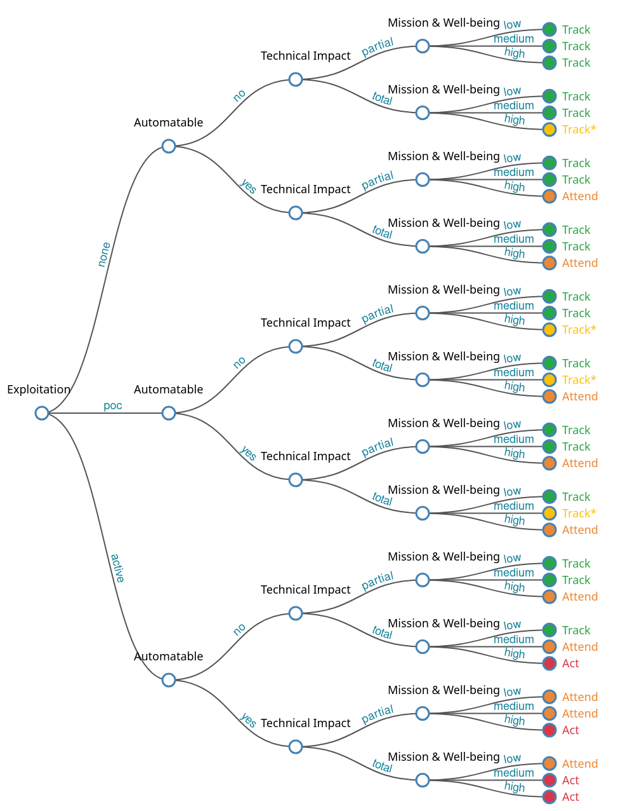

#### Уязвимости
Уязвимость - недостаток в программно-техническом обеспечении или в системе в целом, который может быть использован для реализации угроз безопасности информации. Можно так же сказать, что уязвимость - это слабое место актива или средства защиты информации, которое может быть эксплуатировано злоумышленником.
Информация об уязвимостях публикуется специальными организациями, которые так же присваивают каждой уязвимости уникальный идентификатор. Это делается для более удобного поиска информации об уязвимости, и всем, что с ней связано. Информация об уязвимостях хранится в специальных сервисах, называемых Базами данных уязвимостей.
##### БДУ
База данных уязвимостей - сервис, предоставляющий пользователю доступ к информации об уязвимости.
Сервис может быть закрытым и открытым, платным и бесплатным, машинно-читаемый и нет.
###### ФСТЭК
ФСТЭК России - это Федеральная служба по техническому и экспортному контролю. Она является федеральным органом исполнительной власти, который занимается обеспечением безопасности информации в ключевых системах информационной инфраструктуры, противодействием техническим разведкам и технической защитой информации, а также осуществляет экспортный контроль.

**Ссылки:** [Ссылка](https://bdu.fstec.ru/files/documents/thrlist.xlsx) на список угроз в формате XLSX, [Ссылка](https://bdu.fstec.ru/files/documents/vulxml.zip) на список уязвимостей в формате XML.

###### MITRE CWE
[Ссылка](https://cwe.mitre.org/data/downloads.html) на страницу с архивами. [Ссылка](https://github.com/CWE-CAPEC/REST-API-wg) на гитхаб с версией архива в жсон формате.

###### MITRE CVE
[Ссылка](https://github.com/CVEProject/cvelistV5/releases) на гитхаб в котором каждый час обновляется база данных с уязвимостями

###### MITRE CCE

###### CISA KEV
Known Exploited Vulnerabilities (KEV) - каталог известных и устоявшихся уязвимостей, о которых зарегестрированно множество реальных случаев эксплуатации, и которые продолжают регистрироваться до сих пор.
Каталог можно скачать в форматах JSON и CSV, которые удобны для автоматизации.

**Ссылки**: [Ссылка](https://www.cisa.gov/known-exploited-vulnerabilities-catalog) на основной сайт, [Ссылка](https://www.cisa.gov/sites/default/files/feeds/known_exploited_vulnerabilities_schema.json) на JSON схему, [Ссылка](https://www.cisa.gov/sites/default/files/feeds/known_exploited_vulnerabilities.json) на каталог в формате JSON, [Ссылка](https://www.cisa.gov/sites/default/files/csv/known_exploited_vulnerabilities.csv) на каталог в формате CSV.

##### БДЭ
Базы данных эксплоитов - сервис, предоставляющий пользователю доступ к информации об эксплоитах к уязвимостям.
###### ExploitDB
###### AttackerDB
##### Методы оценки уязвимостей
Методы оценки уязвимостей - способы, методики или алгоритмы оценки уязвимости, предоставляющие возможность количественно или качественно оценить уязвимость и представить её в качестве числа. Различные методики оценивают уязвимость по разному алгоритму и в разном контексте, но конечным результатом каждого алгоритма является число, представляющее опасность (или риск эксплуатации) уязвимости.
Существует множество методов оценки от различных организаций и различными лицензиями, но отраслевым стандартом принято считать методику оценки CVSS от огранизации MITRE.
###### Стандарт CVSS
Common Vulnerability Scoring System (CVSS) - стандарт, который используется для количественной оценки риска уязвимости. Стандарт используется для предоставления единообразной и понятной оценки опасности уязвимости. Это помогает организациям приоритизировать свои усилия для их исправления.
Оценка по CVSS производится в пределах десятибалльной шкалы, в которой:
- 0.1 - 3.9 балла соответствуют *низкой* степени риска;
- 4.6 - 6.9 балла соответствуют *средней* степени риска;
- 7.0 - 10.0 балла соответствуют высокой степени риска.
  При этом CVSS оценивает уязвимости по нескольким группам параметров, а именно:
- базовая оценка (Basic Score);
- временная оценка (Temporal Score);
- оценка окружения (Environmental Score).
  Эти параметры помогают определить, насколько легко использовать уязвимость и к каким последствиям это может привести.
  На данный момент разработано 4 основных версии стандарта: v1, v2, v3, v4; которые несовместимы между собой.
###### Методика VISS
##### Методы приоритизации уязвимостей
###### Методика SSVC
Приоритизация уязвимостей по методике SSVC осуществляется с помощью специального дерева принятия решений.
Особенностью этой методики является то, что она контекстуальна, а её результаты могут отличаться для различных организаций.
Полное дерево принятия решений выглядит так:

Здесь каждый узел означает ответ на один из соответствующих вопросов, согласно ответу выбирается следующая ветка, которая ведет в следующий узел, и так до финального узла, означающего назначенный уязвимости приоритет.
Корневой узел, называемый "Exploitation", отвечает на вопрос о распространенности уязвимости и состоянии эксплуатации уязвимости.
Всего может быть 3 ответа:
1. *none* - нет доказательств, что данная уязвимость имеет публичный эксплоит или была проэксплуатирована в реальных условиях;
2. *poc* - выбирается в 4х случаях:
    1. ф
    2. ф
    3. ф
    4. ф
3. *active* - уязвимость имеет зарегистрированные случаи эксплуатации в реальных уяловиях.
   Следующий узел называется "Automatable" и отвечает на вопрос о возможностях автоматизации эксплуатации уязвимости.
   Может быть только 2 ответа:
- *yes* - ;
- *no* - .
  После чего идет узел "Technical Impact", отвечающий на вопрос о последствиях эксплуатации уязвимости.
  Всего может быть 2 ответа:
- *partial* - ;
- *total* - .
  Последний узел называется "Mission & Well-being" и отвечает сразу на 2 вопроса, из ответа на которые формируется ответ.
  Вопрос "Mission Prevalence" отвечает на вопрос о
###### Методика ОСОКА
##### Методы оценки эксплуатабельности уязвимости
###### Система EPSS
Exploit Prediction Scoring System - система, разработанная для оценки вероятности эксплуатации уязвимости в реальных условиях.
##### Методы принятия решений
###### Методика SSPP
###### Методика НКЦКИ
